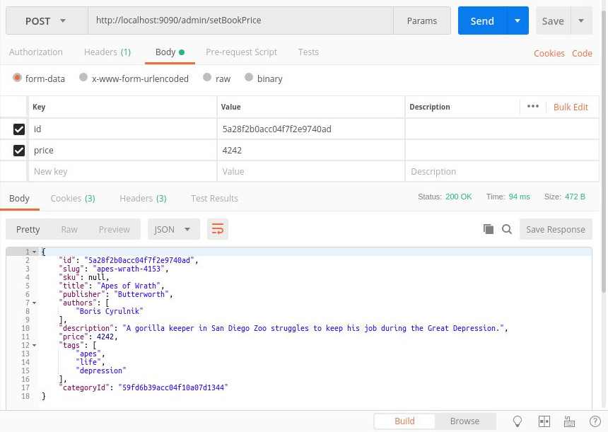

# gutenberg-cantabile
I present here a microservice-oriented application that is a Reactive version of the previous project [gutenberg-allegro](https://github.com/dubersfeld/gutenberg-allegro). This project uses an Elasticsearch Docker image instead of the local Elasticsearch service that should be stopped to avoid any port conflict. In addition I have implemented some basic test classes for the four backend servers.

**The only change from gutenberg-allegro is that all communication between microservices is implemented using Spring WebFlux primitives instead of Spring Web primitives. So all RESTful servers return Mono<T> or Flux<T> inside the body of a Mono<ServerResponse>. The global behavior remains the same.**

Here are the prerequisites for running the complete application:

A recent Docker version installed (I used 19.03.11-ce)
A recent Apache Maven version installed (I used 3.6.0)
An HTTP tool like Postman or equivalent.
I took advantage of the new native Docker support provided by Spring Boot 2.3.
  
In addition I used Spring Tool Suite for developing this demo but it is not required for running the application.

# 1 Basic application

Here is the list of all 9 containers:

Server            | Image                                               | Port | Function             | Database connection
---------------   | ----------------------------------------------------| ---- | -------------------  | -------------------
elastic-books     | docker.elastic.co/elasticsearch/elasticsearch:6.6.1 | 9200 | Schemaless database  | 
config-server     | gutenberg/config-server                             | 8888 | Configuration server | None
eurekaserver      | gutenberg/eureka-server                             | 8761 | Discovery server     | None
book-service      | gutenberg/book-server                               | 8081 | Book requests        | gutenberg-books
review-service    | gutenberg/review-server                             | 8082 | Review requests      | gutenberg-reviews
order-service     | gutenberg/order-server                              | 8083 | Order requests       | gutenberg-orders
user-service      | gutenberg/user-server                               | 8084 | User requests        | gutenberg-requests
gateway-service   | gutenberg/gateway-server                            | 5555 | Gateway              | None
frontend-service  | gutenberg/frontend-server                           | 8080 | frontend             | None

A volume is used for persistence.
 
A gateway is used to hide some Spring servers. Here is the list:

Server           | Port | Gateway URI
---------------- | ---- | -------------------------
book-service     | 8081 | gateway-service:5555/books
review-service   | 8082 | gateway-service:5555/reviews
order-service    | 8083 | gateway-service:5555/orders
user-service     | 8084 | gateway-service:5555/users

Here are the steps to run the application:

## 1.1 Images creation with test included

Here is a safe way of creating all images with tests included. In this way an image is created only if all tests are successful.

Go to the subdirectory dockerbuild.
Run the command `docker-compose up` that starts an Elasticsearch container. 

Run the bash script buildSpring

```
#!/bin/bash

# filename buildSpring

pwd

#for server in 'book-server' 'config-server' 'order-server' 'review-server' 'user-server' 'eureka-server' 'gateway-server' 'frontend-server';
for server in 'book-server' 'config-server' 'order-server' 'review-server' 'user-server' 'eureka-server' 'gateway-server' 'frontend-server';
do 
    echo ${server}
    cd ../$server
    pwd
    ./create
    ./build

    echo $?
    if [ "$?" -ne 0 ]
    then 
      echo "Build failed for $server"
      exit "$?"
    fi

done;
```

Note that it populates the indices needed for testing.

Then run the bash script buildSecond:

```
#!/bin/bash
#buildSecond

for f in 'book' 'config' 'frontend' 'gateway' 'order' 'review' 'user' 'eureka';
do 
   echo ${f}
   cd $f
   pwd
   ./build.sh
   cd ..

   echo $?
   if [ "$?" -ne 0 ]
   then 
      echo "Build failed for $f"
      exit "$?"
   fi
done;
``` 

This creates the 8 Spring images. The remaining non Spring images will be pulled from a Docker repository.

Then stop the Elasticsearch container with the command `docker-compose down`. 

## 1.2 Running the application

### 1.2.1 Adding user to Docker group

To avoid using sudo run this command:

```
sudo usermod -aG docker $USER
```

### 1.2.1 Volume creation

To create the volume used for persistence run the command: `docker volume create gutenberg-es-data`

### 1.2.3 Starting the application
To start the application go to docker subdirectory and run the command:

```
docker-compose up
```

All running Spring containers can be seen on Eureka port 8761.

The frontend itself is accessed on URL localhost:8080/gutenberg. A username and password are required. Here are the prepopulated users:

Username | Password
-------- | --------- 
Carol    | s1a2t3o4r 
Albert   | a5r6e7p8o
Werner   | t4e3n2e1t
Alice    | o8p7e6r5a
Richard  | r1o2t3a4s
Sator    | sator1234 
Arepo    | arepo1234
Tenet    | tenet1234
Opera    | opera1234
Rotas    | rotas1234

### 1.2.2 Populating the ElacsticSearch indices

Once the servers have started go to docker/elasticsearch subdirectory and run the commands:
```
./createBooks.sh
./createCategories.sh
./createUsers.sh
./createReviews.sh
./createOrders.sh
```
It creates all prepopulated indices.

To stop the application run the command in docker subdirectory:

```
docker-compose down
```

Here is a snapshot of the welcome page:


## 1.3 Searching for a book

Enter one or several keywords in the keywords field. Note that gutenberg-books index is searched for matches in three distinct fields: "title", "description", "tags"

Here is a snapshot of the search results for keywords "gorilla quantum pattern captain":


## 1.4 Registering a new user

Click on register on Login page then fill the registration form. The username should not be already present in gutenberg-users  index. Once registered the new user can connect to frontend server.

## 1.5 Using admin-service
To access admin-service the best way is to use Postman or any similar application. The URI is localhost:9090/admin. To start admin-server go in subdirectory admin-server and run the command `mvn spring-boot-run`. 

Here are two snapshots of Postman interaction:




Cachan September 5 2020
